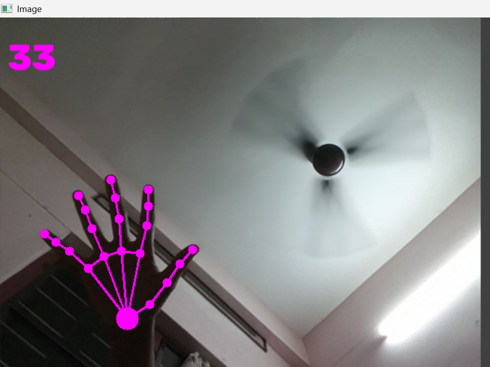

# Hand Tracking using MediaPipe and OpenCV

A real-time hand tracking application built using Python, MediaPipe, and OpenCV. The application detects hand landmarks through a webcam and displays the landmarks on the live video feed.

## Problem It Solves

Hand tracking is an important part of computer vision and human-computer interaction. This project demonstrates how a webcam can be used to detect and track the position of a hand and its landmarks in real time.

## Key Features

- Real-time hand detection using a webcam
- Detects and tracks hand landmarks
- Displays hand landmark points and connections
- Shows the total number of detected landmarks
- Works with live camera input
- Press `Q` to exit the application

## Technologies Used

- Python
- OpenCV
- MediaPipe

## Project Screenshot



## How to Run Locally

### 1. Clone the repository

```bash
git clone https://github.com/roopamathew/HandTracking_Project.git